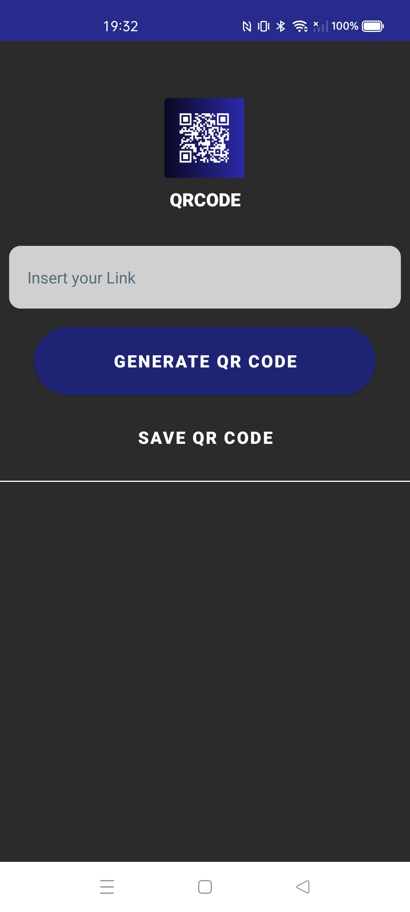

# QRCode Maker (pt-br)

QRCode Maker é um **aplicativo Android** focado em **ajudar pessoas que tem dificuldade em criar e manter contatos com outroas pessoas durante momentos de networking em eventos presenciais**.

O aplicativo permite que você **crie um qrcode a partir de qualquer link**.

Desse modo, a pessoa consegue repassar um link com as informações que são mais importantes para a outra pessoa, durante um momento de networking.

Dentro do aplicativo é possível **criar o qrcode a partir do link desejado**, e posteriormente **salvar a imagem gerada do qrcode**.

## Objetivo 

Ajudar **pessoas que tem dificulade em repassar informações para manter contato**, durante situações de netkworing.

### Tecnologias & Tools

* Kotlin;
* Material Design;
* constraintlayout;
* Gradle;
* Trello.

### Status: Concluído

## Telas

   
  
  
  
 
 

-------------------------------------------------------------------------------------------------------------------------------------------

# QRCode Maker (en)

QRCode Maker is an **Android App** focused on **helping people who have difficulty to keep in touch with other people during networking moments in events**.

The app allows you to **create a qrcode from any link**.

In this way, the person can input a link with the information that is most important to them, and send to the other person during a networking moment through the qrcode.

Within the application it is possible to **create the qrcode from the desired link**, and **save the generated image of the qrcode**.

## Goal

Help **people who have difficulty passing on information to keep in touch**, during netkworing situations.

### Tecnologias & Tools

* Kotlin;
* Material Design;
* constraintlayout;
* Gradle;
* Trello.

### Status: Completed.

## Screens

  
  
  
  
  
 

