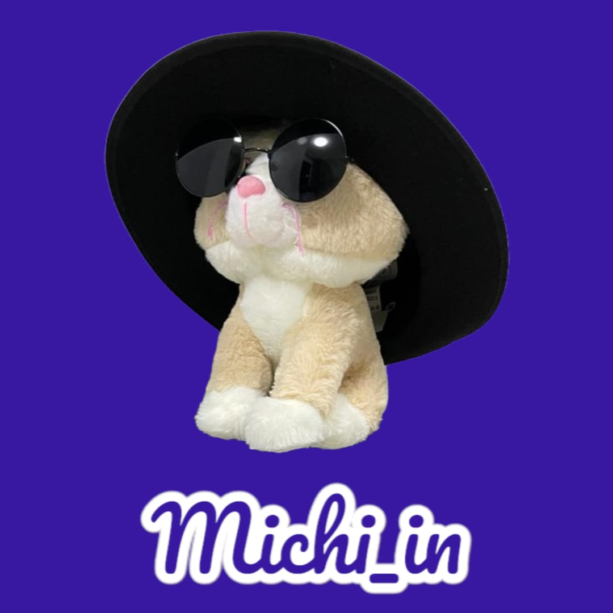

# 📱 QRCode Maker App

A modern Android app to **quickly create, save and share QR codes** from any link.  
Built with **Kotlin**, **MVVM architecture**, **LiveData** and **Material Design**, focusing on clean code, scalability and great user experience.

---

## ✨ **Features**
- Generate QR codes instantly from URLs
- Save and reuse generated codes
- Intuitive interface following Material Design guidelines
- Lightweight and fast performance
- Modular, testable and maintainable architecture

---

## 🛠 **Tech Stack & Architecture**
- **Android SDK**
- **Kotlin** – modern, concise and safe language
- **MVVM (Model–View–ViewModel)** – better separation of concerns & testability
- **LiveData & Data Binding** – reactive, maintainable UI
- **Material Design components** – native look & feel
- **Clean Architecture + Modularization**
- **Gradle (Kotlin DSL / kts)** – modern build scripts
- **Libs version control** using TOML

---

## 🎨 **UI & UX**
- Designed with **Material Design** principles
- Smooth user experience with responsive layouts
- Custom design patterns to simplify code and UX
- XML layouts using **ConstraintLayout**

---

## ✅ **Status**
Completed ✔️

---

## 📸 **Screenshots**

  
  
  
  

